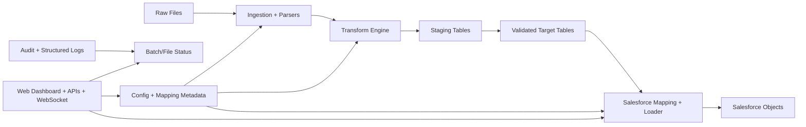

# Metadata-Driven File → Database → Salesforce Utility (Real-Time Web Edition)

Production-ready reusable ETL/ELT utility to load heterogeneous raw files into a database and push transformed data to Salesforce, now with a **real-time web control plane**.

## High-Level Architecture



## Real-Time Website Features

- Trigger ETL runs by environment (DEV/QA/UAT/PROD)
- Live job event stream over WebSocket
- Job history and current status
- Mapping preview endpoint
- Environment configuration preview endpoint
- Batch/file audit retrieval endpoint
- Same metadata-driven backend pipeline used by CLI and Web UI

## Project Structure

```text
src/etl_sf/
  orchestration/pipeline.py         # ETL orchestration + progress callbacks
  web/app.py                        # FastAPI dashboard + APIs + websocket
  web/job_manager.py                # in-memory real-time job lifecycle manager
  ingestion/ parsers/ mappings/ transformations/
  database/ salesforce/ audit/ config/
configs/
  base.yml + environments/*
  mappings/file_to_db.yml
  mappings/db_to_salesforce.yml
sql/schema.sql
tests/
```

## API Surface (Website Backend)

- `GET /` : Dashboard UI
- `POST /api/jobs/run?env=dev` : Start a run
- `GET /api/jobs` : List jobs
- `GET /api/jobs/{job_id}` : Job details
- `WS /ws/jobs/{job_id}` : Live events
- `GET /api/environments` : Effective env snapshot
- `GET /api/mappings` : Current mapping metadata
- `GET /api/audits?env=dev` : Batch/file audit records

## Setup

```bash
python -m venv .venv
source .venv/bin/activate
pip install -e .[dev]
```

## Run CLI

```bash
python -m etl_sf.main --config-root configs --env dev --init-db --ddl sql/schema.sql
```

## Run Website

```bash
python -m etl_sf.web.app
# or
etl-sf-web
```

Open: `http://localhost:8000`

## Notes for Production Hardening

- Replace `MockSalesforceClient` with real Bulk API 2.0 adapter
- Persist job state in Redis/Postgres instead of in-memory manager
- Add authentication/authorization (SSO/JWT)
- Add task queue (Celery/RQ) for horizontal scale
- Add reconciliation report exports and alerting
